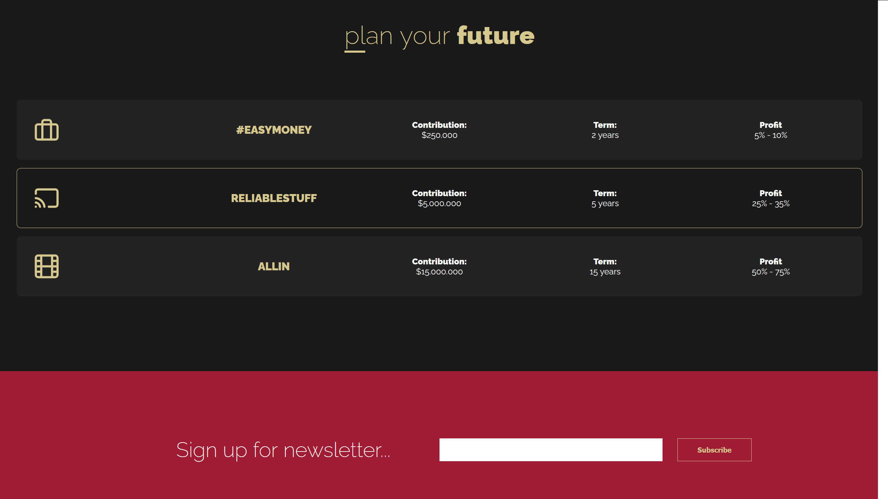
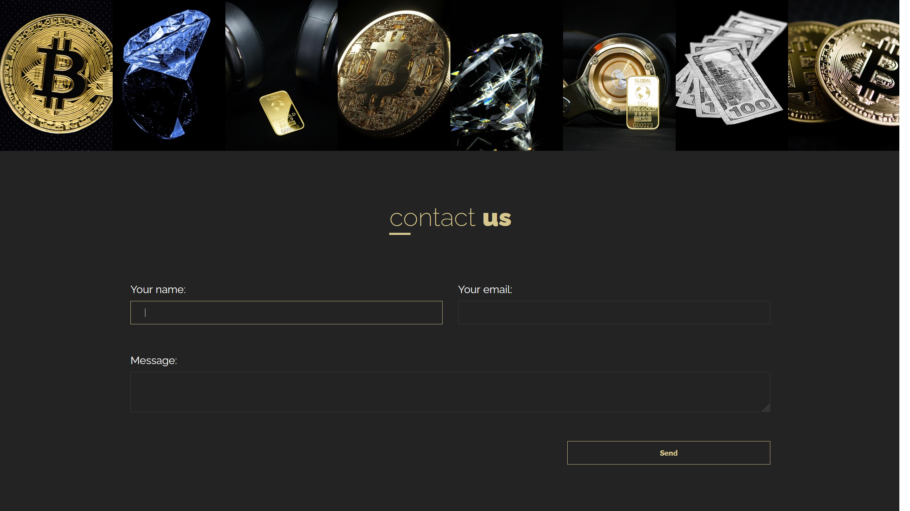

# Diamonds, Gold & Money

## Screenshots

    </img>
     
    </img>
     
    </img>
     
    </img>

## Description

- Website of a (hypothetical) company called Diamonds, Gold & Money.
- This project is a one-page type of website.
- **Mobile first strategy used!**
- Website contains few sections and many animations, like moving gray shapes in the background (As You can see on the screenshots).

#### Technology used:
- HTML, CSS, JS
- CSS variables
- SCSS
- GRID
- BEM methodology

## What I Learned

- Using most important **SEO tags** in modern websites.
- Using SCSS in a bigger project with many classes.
- Using **rows** and **columns** in Bootstrap
- Creating hero-images and sliders of images.
- Creating cards with Bootstrap Library and style them.

## Author info

- **Name:** Filip Bereszyński
- **Age:** 21 years old
- **Contact:**
    - bereszynski.filip@gmail.com
    - (+48) 510 240 074